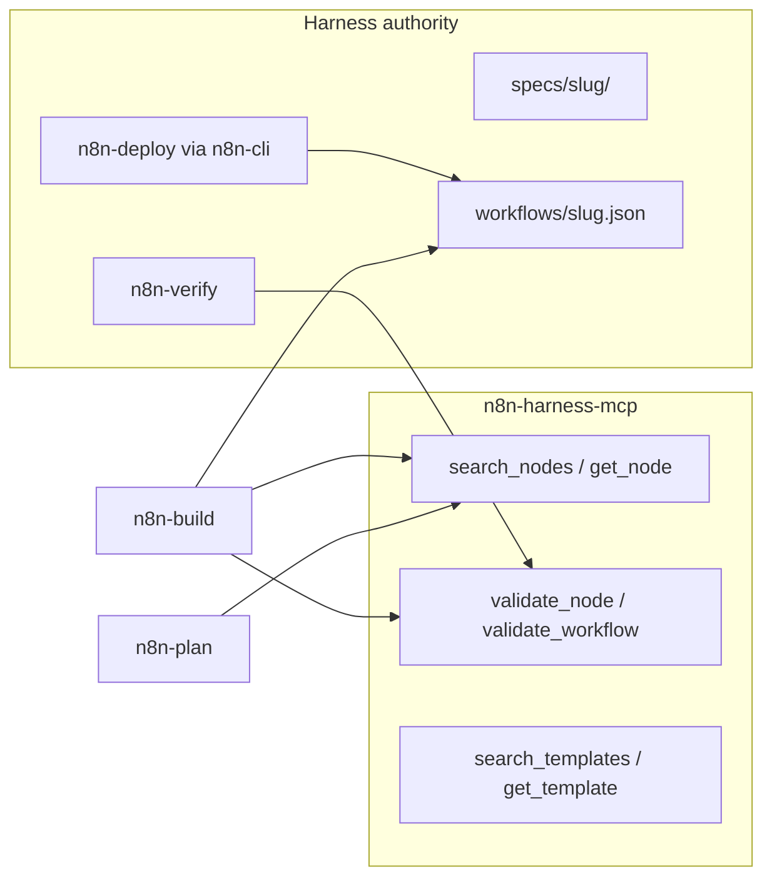

# n8n-harness-mcp — architecture and improvement guide

Canonical maintainer reference for the vendored server under `mcp/`. Operators and harness agents should use [../../docs/mcp-local.md](../../docs/mcp-local.md) and [../../docs/mcp-pipeline.md](../../docs/mcp-pipeline.md) instead.

**Package:** `n8n-harness-mcp` (private fork of [czlonkowski/n8n-mcp](https://github.com/czlonkowski/n8n-mcp))  
**Cursor skill (short map):** [../../.cursor/skills/n8n-mcp-maintain/ARCHITECTURE.md](../../.cursor/skills/n8n-mcp-maintain/ARCHITECTURE.md)  
**Fork phases (local):** `plan/README.md` (gitignored in repo; on disk if you maintain the fork)

---

## Role in the harness



- **MCP** supplies node documentation, parameter shapes, and validation hints.
- **Harness** owns specs, git workflow JSON, `[APPROVE]`/`[REJECT]`, and Cloud deploy.
- Default Cursor config disables remote workflow tools; see [../../.cursor/mcp.json](../../.cursor/mcp.json) `DISABLED_TOOLS`.

---

## Runtime architecture

### Entry and transport

| Path | Role |
|------|------|
| `src/mcp/index.ts` | Process entry: stdio (Cursor), optional HTTP modes upstream |
| `src/mcp/server.ts` | MCP server setup, tool registration, request routing |
| `src/mcp/tools.ts` | Tool definitions and handlers (delegates to engines/handlers) |
| `src/mcp-tools-engine.ts` | Core tool execution for documentation/validation tools |
| `src/mcp-engine.ts` | Shared engine wiring |

Cursor starts: `node ${workspaceFolder}/mcp/dist/mcp/index.js` with `MCP_MODE=stdio`, `NODE_DB_PATH` → `mcp/data/nodes.db`.

### Request flow (documentation tools)

```
MCP client (Cursor)
  → stdio JSON-RPC
  → server.ts (tool dispatch)
  → mcp-tools-engine / handlers
  → services/* (validators, property filter, …)
  → database/node-repository.ts (SQLite)
  → response (node schema, validation result, …)
```

Optional **n8n instance** tools (when `N8N_API_URL` is set and tools not disabled) call `src/config/n8n-api.ts` and workflow handlers under `src/mcp/handlers-n8n-manager.ts`, `handlers-workflow-diff.ts`. The harness default keeps these disabled.

---

## Source layout (`mcp/src/`)

| Area | Purpose |
|------|---------|
| `loaders/node-loader.ts` | Load node definitions from n8n packages |
| `parsers/` | Parse node metadata, properties, versions |
| `mappers/docs-mapper.ts` | Map raw node data to stored documentation |
| `database/` | SQLite schema, adapter, `node-repository`, migrations |
| `services/` | Business logic: validation, property filter, workflow diff, autofix, expressions |
| `mcp/tool-docs/` | Per-tool documentation strings exposed to agents |
| `mcp/skills/` | Embedded skill registry (mirror of `mcp/data/skills/`) |
| `templates/` | Workflow template fetch/store/search |
| `community/` | Community node documentation pipeline |
| `triggers/` | Trigger-type helpers (webhook, form, chat, …) |
| `scripts/` | Rebuild DB, fetch templates, maintainer utilities |
| `utils/` | Logging, SSRF, node-type normalization, caching |

**Committed artifact:** `data/nodes.db` (prebuilt node documentation). **Build output:** `dist/` (not committed; produced by `npm run build`).

---

## Tool categories

| Category | Examples | Harness default |
|----------|----------|-----------------|
| **Discovery** | `search_nodes`, `get_node`, `tools_documentation` | Enabled |
| **Validation** | `validate_node`, `validate_workflow` | Enabled (required in pipeline) |
| **Templates** | `search_templates`, `get_template` | Enabled |
| **Workflow (remote)** | `n8n_create_workflow`, `n8n_update_*`, `n8n_delete_workflow`, … | **Disabled** in `.cursor/mcp.json` |
| **Audit / credentials** | `n8n_audit_instance`, `n8n_manage_credentials` | **Disabled** |

Tool doc strings live under `src/mcp/tool-docs/` (discovery, validation, workflow_management, templates, system, guides).

---

## Data layer

- **Database:** SQLite (`data/nodes.db`), path override via `NODE_DB_PATH`.
- **Rebuild:** `npm run rebuild --prefix mcp` (slow; re-extracts from n8n node packages). Maintainer-only when node catalog changes.
- **Details:** [DATABASE_CONFIGURATION.md](./DATABASE_CONFIGURATION.md)

Design patterns:

- **Repository** — `node-repository.ts`, template repositories
- **Service layer** — validators and filters stay out of MCP handlers
- **Normalization** — `utils/node-type-normalizer.ts` (`nodes-base.*` vs `n8n-nodes-base.*`)

---

## Validation system

Profiles (see tool docs and [VALIDATION_GUIDE in Cursor skills](../../.cursor/skills/n8n-mcp-local/VALIDATION_GUIDE.md)):

| Profile | Typical use |
|---------|-------------|
| `minimal` | Quick structural check |
| `runtime` | Default for harness verify |
| `strict` | Stricter config and connections |
| `ai-friendly` | Looser for agent iteration |

Key services:

- `services/workflow-validator.ts` — full workflow
- `services/enhanced-config-validator.ts` / `config-validator.ts` — per-node
- `services/expression-validator.ts` — `{{ }}` expressions
- `services/workflow-auto-fixer.ts` — optional auto-fix suggestions

Harness still runs `scripts/validate-workflow.mjs` in the repo; MCP validation does not replace `n8n-verify`.

---

## Harness fork decisions

Documented in maintainer `plan/README.md` and [../../docs/mcp-cursor-import.md](../../docs/mcp-cursor-import.md):

| Topic | Choice |
|-------|--------|
| Telemetry | Removed (no outbound analytics) |
| `nodes.db` | Committed prebuilt |
| Runtime | stdio only for agents |
| Remote workflow tools | Off by default (`DISABLED_TOOLS`) |
| Legal | `mcp/LICENSE`, `mcp/THIRD_PARTY.md` |

---

## How to improve the server

Use this section as an index; deep dives remain in linked files.

### 1. Quick wins (code health)

| Action | Where to look |
|--------|----------------|
| Fix validation false positives | `services/*validator*`, [../../.cursor/skills/n8n-validation-expert/](../../.cursor/skills/n8n-validation-expert/) |
| Node prefix normalization | `utils/node-type-normalizer.ts` — see [local/DEEP_DIVE_ANALYSIS_2025-10-02.md](./local/DEEP_DIVE_ANALYSIS_2025-10-02.md) (P0 prefix catastrophe) |
| Null-safety in `get_node` | parsers + repository — same deep dive (TypeError rates) |
| Expand task / fuzzy search | discovery tools — [local/Deep_dive_p1_p2.md](./local/Deep_dive_p1_p2.md) |

### 2. Planned work (upstream analysis)

| Doc | Content |
|-----|---------|
| [local/DEEP_DIVE_ANALYSIS_README.md](./local/DEEP_DIVE_ANALYSIS_README.md) | Index; P0/P1 summary |
| [local/DEEP_DIVE_ANALYSIS_2025-10-02.md](./local/DEEP_DIVE_ANALYSIS_2025-10-02.md) | Telemetry-era usage analysis (patterns still apply to validation UX) |
| [local/P0_IMPLEMENTATION_PLAN.md](./local/P0_IMPLEMENTATION_PLAN.md) | Immediate fixes |
| [local/Deep_dive_p1_p2.md](./local/Deep_dive_p1_p2.md) | Architectural and P2 items |
| [local/N8N_AI_WORKFLOW_BUILDER_ANALYSIS.md](./local/N8N_AI_WORKFLOW_BUILDER_ANALYSIS.md) | AI builder comparison |
| [local/TEMPLATE_MINING_ANALYSIS.md](./local/TEMPLATE_MINING_ANALYSIS.md) | Template quality |
| [local/integration-testing-plan.md](./local/integration-testing-plan.md) | Integration test strategy |

### 3. Security and dependencies

| Doc | Content |
|-----|---------|
| [SECURITY_HARDENING.md](./SECURITY_HARDENING.md) | Hardening checklist |
| [THREAT_MODEL.md](./THREAT_MODEL.md) | Threat model |
| [DEPENDENCY_UPDATES.md](./DEPENDENCY_UPDATES.md) | Sync n8n package versions |
| `plan/08-security-checklist.md` | Harness IT / hackathon sign-off |

### 4. Workflow diff and remote tools

| Doc | Content |
|-----|---------|
| [workflow-diff-examples.md](./workflow-diff-examples.md) | Partial update operations |
| `src/services/workflow-diff-engine.ts` | Diff implementation |

Only enable remote `n8n_*` tools after security review; harness deploy stays on `n8n-cli`.

### 5. Harness-side improvements (not `mcp/src`)

| Area | Doc |
|------|-----|
| When agents must call MCP | [../../docs/mcp-pipeline.md](../../docs/mcp-pipeline.md) |
| Cursor skills for tools | [../../.cursor/skills/n8n-mcp-local/](../../.cursor/skills/n8n-mcp-local/) |
| Sync embedded skills | `npm run sync:skills --prefix mcp` (`scripts/sync-skills.ts`) |

---

## Maintainer workflow

### Build and verify

From repo root:

```powershell
npm run mcp:install    # first time or lockfile change
npm run mcp:build      # tsc → mcp/dist/
npm run typecheck --prefix mcp
npm run validate --prefix mcp   # if configured
```

After changing `mcp/src/**`: build → ask user to **reload MCP in Cursor** → smoke via [n8n-mcp-local functional checklist](../../.cursor/skills/n8n-mcp-local/SKILL.md).

CI: [../../.github/workflows/mcp-build.yml](../../.github/workflows/mcp-build.yml) on `mcp/**` changes.

### Database rebuild

```powershell
npm run rebuild --prefix mcp
```

Expect minutes and large diffs to `data/nodes.db`. Commit only after validation and team agreement.

### Upstream merge

1. Cherry-pick or manual merge from [czlonkowski/n8n-mcp](https://github.com/czlonkowski/n8n-mcp).
2. Re-apply harness choices: telemetry off, tool disables, package rename.
3. Rebuild, reload MCP, run typecheck.
4. Update [../../mcp/CHANGELOG.md](../../mcp/CHANGELOG.md) and `plan/CHANGELOG.md` if used.

### Adding or changing a tool

1. Implement handler in `mcp-tools-engine` / dedicated handler file.
2. Register in `src/mcp/tools.ts`.
3. Add `src/mcp/tool-docs/<category>/<tool>.ts` and export from category `index.ts`.
4. Update [../../.cursor/skills/n8n-mcp-local/TOOLS_CATALOG.md](../../.cursor/skills/n8n-mcp-local/TOOLS_CATALOG.md) if harness agents should use it.
5. If disabled for harness, add to `DISABLED_TOOLS` in `.cursor/mcp.json` and document in [mcp-local.md](../../docs/mcp-local.md).

---

## Related documentation

| Audience | Document |
|----------|----------|
| Operators | [../../docs/mcp-local.md](../../docs/mcp-local.md) |
| Harness pipeline | [../../docs/mcp-pipeline.md](../../docs/mcp-pipeline.md) |
| Cursor maintain skill | [../../.cursor/skills/n8n-mcp-maintain/SKILL.md](../../.cursor/skills/n8n-mcp-maintain/SKILL.md) |
| Import log | [../../docs/mcp-cursor-import.md](../../docs/mcp-cursor-import.md) |
| Technical index | [README.md](./README.md) |
| Package readme | [../README.md](../README.md) |

---

## Changelog

Record user-visible MCP changes in [../CHANGELOG.md](../CHANGELOG.md).
