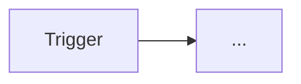

# ARCHITECTURE — <workflow title>

**Slug:** `<slug>`  
**Workflow file:** `workflows/<slug>.json`  
**Workflow kind:** `orchestrator` | `reusable`

## Go live on deploy

<!-- yes | no | manual — see n8n-plan. Reusables: prefer no (REMINDERS.md P1.3) -->

| Setting | Value |
|---------|--------|
| Go live after deploy | yes / no / manual |
| Notes | e.g. webhook only works after activate |

## Trigger

<!-- orchestrator: Webhook / Schedule / Manual. reusable: often Manual only for testing -->

### Event schema

```json
{}
```

## Node graph



## Node responsibilities

Use **story-style** plain English names (see `docs/best-practices.md`).

| Node name | Type (verified) | Responsibility |
|-----------|-----------------|----------------|
| Does user have email? | nodes-base.if | … |

<!-- Type (verified) = MCP nodeType from n8n-plan step 2d (search_nodes → get_node). Do not guess. -->

<!-- SharePoint/PDF: cite docs/exemplos-patterns.md pattern IDs (exo-1…exo-5). PDF read = extractFromFile pdf, not HTTP read API. -->

## Data flow

1.

## Error handling

**Mode:** `global` (preferred) | `local-exceptional`

| Item | Value |
|------|--------|
| Global error workflow name | |
| Global error workflow id | (after deploy) |
| Local Error Trigger justification | (required if local-exceptional) |

## Retries and concurrency

| Node | Retry | Notes |
|------|-------|-------|
| | | |

## Sub-workflows

### Consumes (orchestrator)

| Execute Workflow node name | Child workflow | Inputs | Outputs |
|----------------------------|----------------|--------|---------|
| Resolve user profile by email | `resolve-user-by-email` | `email` (string) | `slackId`, `jiraId`, … |

### Called by (reusable only)

| Parent workflow | Purpose |
|-----------------|---------|
| | |

## Reusable contract (if workflow kind = reusable)

**Inputs**

| Field | Type | Required | Description |
|-------|------|----------|-------------|
| | | | |

**Outputs**

| Field | Type | Description |
|-------|------|-------------|
| | | |

**Governance:** viewable by all; write access restricted (high blast radius).

## Settings

```json
{
  "executionOrder": "v1",
  "errorWorkflow": "<id-or-empty-until-deploy>"
}
```
