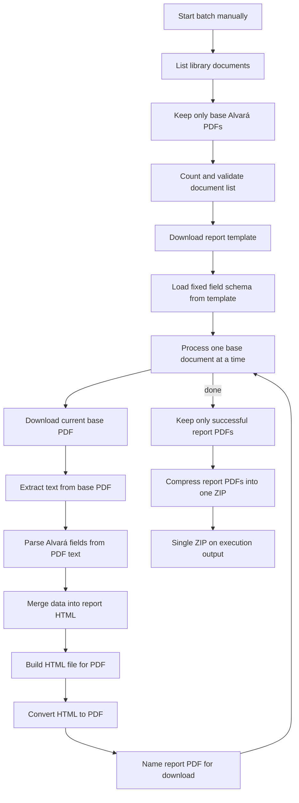

# ARCHITECTURE — Generate Alvará reports from SharePoint base documents

**Slug:** `generate-alvara-reports-from-sharepoint`  
**Workflow file:** `workflows/generate-alvara-reports-from-sharepoint.json`  
**Workflow kind:** `orchestrator`

## Go live on deploy

| Setting | Value |
|---------|--------|
| Go live after deploy | **manual** (confirmed) |
| Notes | Manual Trigger only; activation does not expose a webhook |

## Trigger

**Manual Trigger** — operator clicks **Execute workflow** in n8n.

### Event schema

No inbound payload. Single empty item starts the run.

```json
{}
```

## Node graph



**Reference patterns:** [docs/exemplos-patterns.md](../../docs/exemplos-patterns.md) — **exo-1** (list/filter/loop/download), **exo-3** (template), **exo-4** (Extract from File `pdf`), **exo-5** (HTML→PDF HTTP). Catalog pattern D in `docs/n8n-node-catalog.md`. Extraction: **deterministic Code parse** on exo-4 output (no LLM, no PDF read API).

## Node responsibilities

| Node name | Type (verified) | Responsibility |
|-----------|-----------------|----------------|
| Start batch manually | nodes-base.manualTrigger | On-demand start |
| List library documents | nodes-base.microsoftSharePoint | Item → Get Many on `Documents`, `returnAll`, `simplify: false` |
| Keep only base Alvará PDFs | nodes-base.filter | Same conditions as Exemplos `Filtrar arquivos 'docs' da pasta1` (If/Filter equivalent, exo-1) |
| Count and validate document list | nodes-base.code | **Fail workflow** if filtered PDF count ≠ 20; clear error message before loop starts |
| Download report template | nodes-base.microsoftSharePoint | File → download `template_licenciamento.pdf` from `03 - Template` |
| Load fixed field schema from template | nodes-base.code | Hard-coded schema from `template_licenciamento.pdf` (10 extract + `DATA_GERACAO` generated); passes schema to loop context |
| Process one base document at a time | nodes-base.splitInBatches | `batchSize: 1`; loop branch processes each Alvará |
| Download current base PDF | nodes-base.microsoftSharePoint | File → download: **Parent Folder** `02 - Documentos Base` (static) + **File** `id` from loop item `@odata.etag` (exo-1 / `Download Doc_x1`) |
| Extract text from base PDF | nodes-base.extractFromFile | Operation `pdf`, typeVersion `1.1` (**exo-4**) |
| Parse Alvará fields from PDF text | nodes-base.code | Deterministic label→value parse per DESIGN.md (`doc_01.pdf` layout); no LLM |
| Merge data into report HTML | nodes-base.code | Build HTML string from extracted fields + `DATA_GERACAO` (layout per DESIGN.md; **not** filling `template_licenciamento.pdf`) |
| Build HTML file for PDF | nodes-base.convertToFile | Operation `html` → binary `data` (**exo-5** step 2) |
| Convert HTML to PDF | nodes-base.httpRequest | Clone Exemplos node `API de conversão para HTML para PDF1` (LibreOffice convert API, exo-5) |
| Name report PDF for download | nodes-base.set | Set binary `fileName` to `relatorio_<source-stem>.pdf` before loop collects items |
| Keep only successful report PDFs | nodes-base.filter | After loop **done** branch: items with PDF binary and no `processingError` (or equivalent success flag) |
| Compress report PDFs into one ZIP | nodes-base.compression | Operation `compress`, format `zip`; input = successful items only (1–20 PDFs) |

**MCP verification notes**

- Types above verified via MCP `search_nodes` → `get_node` on 2026-06-01, except `nodes-base.extractFromFile` (MCP lookup returned not found; confirmed in `docs/n8n-node-catalog.md` and templates e.g. #6480, #4336 — re-verify at build with `get_node` or Cloud export).
- HTML→PDF via **HTTP Request only** (no community nodes on target instance).

## Data flow

1. **Discover:** Get Many items → filter to base folder → **require exactly 20** PDF rows; abort with error if count differs.
2. **Template (once):** Download `template_licenciamento.pdf` (reference for layout; field schema is fixed in INTEGRATION.md / DESIGN.md).
3. **Per document (loop):** Download base Alvará PDF → extract **text** → **Code parser** maps template labels → structured JSON (values as they appear in the document).
4. **HTML generation (inside n8n, not from SharePoint):** **Merge data into report HTML** (Code node) builds an HTML string that mirrors the template PDF layout and injects the extracted values + `DATA_GERACAO`. **Build HTML file for PDF** (Convert to File) turns that string into an HTML binary.
5. **PDF generation:** HTML binary → HTML→PDF service → report PDF binary → name file → loop back.
6. **Output:** Loop **done** → filter successful items → **Compression** → one ZIP (1–20 PDFs, successes only).

### Where HTML comes from (FAQ)

| Source | Role |
|--------|------|
| `template_licenciamento.pdf` (SharePoint) | **Reference only** — defines which fields exist and how the report should look |
| Base Alvará PDF (SharePoint) | **Data** — text extracted; parser pulls values verbatim for template keys |
| **Code node “Merge data into report HTML”** | **Creates the HTML** — programmatic layout matching DESIGN.md / template structure |
| Convert to File (`html`) | Wraps HTML string as a file for the PDF converter |

There is no HTML file in SharePoint. **PDF generation strategy (confirmed):** HTML intermediate → PDF (layout-equivalent to template, not AcroForm fill of `template_licenciamento.pdf`).

## Error handling

**Mode:** `none` (challenge v1 — justified)

| Item | Value |
|------|--------|
| Global error workflow name | *(none)* |
| Global error workflow id | *(empty — omit or leave blank in settings)* |
| Justification | Challenge instance has no org error handler; per-item **Continue On Fail** + execution UI covers partial failures; operator monitors manual runs |

No local Error Trigger in v1.

Per-item errors inside the loop: **Continue On Fail** enabled on extraction/PDF nodes; failed items tagged in `json` (e.g. `processingError`); loop continues. After loop, only successful items enter ZIP. Workflow succeeds even if ZIP has fewer than 20 PDFs.

## Retries and concurrency

| Node | Retry | Notes |
|------|-------|-------|
| Download report template | 2 | SharePoint transient errors |
| Download current base PDF | 2 | Same |
| Parse Alvará fields from PDF text | 0 | Deterministic; empty string if label not found |
| Convert HTML to PDF | 2 | External PDF API |

Concurrency: sequential loop (`batchSize: 1`) to respect PDF API limits.

## Sub-workflows

None for v1. If template parsing or HTML merge grows complex, extract **Parse and merge Alvará report** as a reusable workflow in a follow-up spec.

## Settings

```json
{
  "executionOrder": "v1"
}
```

`errorWorkflow` omitted for challenge v1 (no global handler on instance).
